<h3 align="center">𝐇𝐞𝐥𝐥𝐨, 𝐟𝐞𝐥𝐥𝐨𝐰 <𝚌𝚘𝚍𝚎𝚛𝚜></𝚌𝚘𝚍𝚎𝚛𝚜>!

### 👋 Hi there! I'm [𝙋𝙚𝙩𝙚𝙧𝟮𝟲𝟳](https://peter267.github.io)
---

Students | Bloggers | Developers | UPmasters

Welcome to my blog!  [Click here](https://peter267.github.io)

[More about me ...](https://peter267.github.io/about/)

### 🐍Voracious Snake
---

### 🏆 Trophy
---

  

### 🔎 Count
---

### 🧮 Stats
---

  

 

### 💻 Languages
---
 

---

